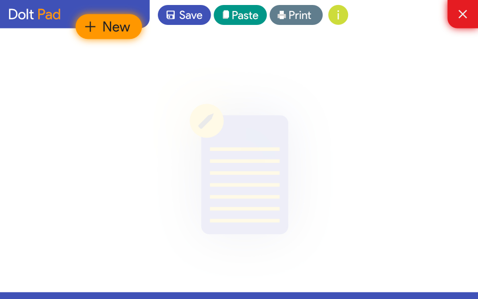
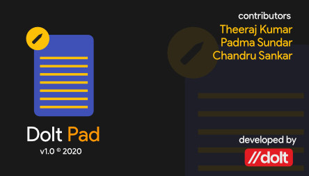

# Dolt Pad - A Redesigned Notepad

A Notepad Application Built using QT Framework with Python as its backend. It features the same functionalities of a normal notepad with a revamped UI

## Features

Dolt Pad Contains features include 

* Creating New Files
* Rich-Text Based Clipboard Pasting
* Printing the file
* Saving it to a local directory

### Application UI Overview

Main Window

About Screen

